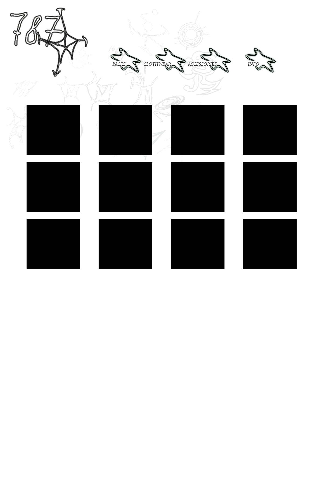

<!DOCTYPE html PUBLIC "-//W3C//DTD XHTML 1.0 Transitional//EN"
"http://www.w3.org/TR/xhtml1/DTD/xhtml1-transitional.dtd">
<!-- saved from url=(0014)about:internet -->
<html xmlns="http://www.w3.org/1999/xhtml">
<head>
<meta http-equiv="Content-Type" content="text/html; charset=utf-8" />
<!--Fireworks CS6 Dreamweaver CS6 target.  Created Fri Oct 13 12:37:08 GMT+0200 2023-->
</head>
<body bgcolor="#ffffff">
<map name="m_web" id="m_web">
<area shape="rect" coords="872,143,1058,303" href="787hsh.tumblr.com/info" alt="" />
<area shape="rect" coords="695,143,872,303" href="787hsh.tumblr.com/acc" alt="" />
<area shape="rect" coords="531,143,695,303" href="787hsh.tumblr.com/clothwear" alt="" />
<area shape="rect" coords="377,143,531,303" href="787hsh.tumblr.com/packs" alt="" />
<area shape="rect" coords="24,15,355,317" href="787hsh.tumblr.com/home" alt="" />
</map>
</body>
</html>
